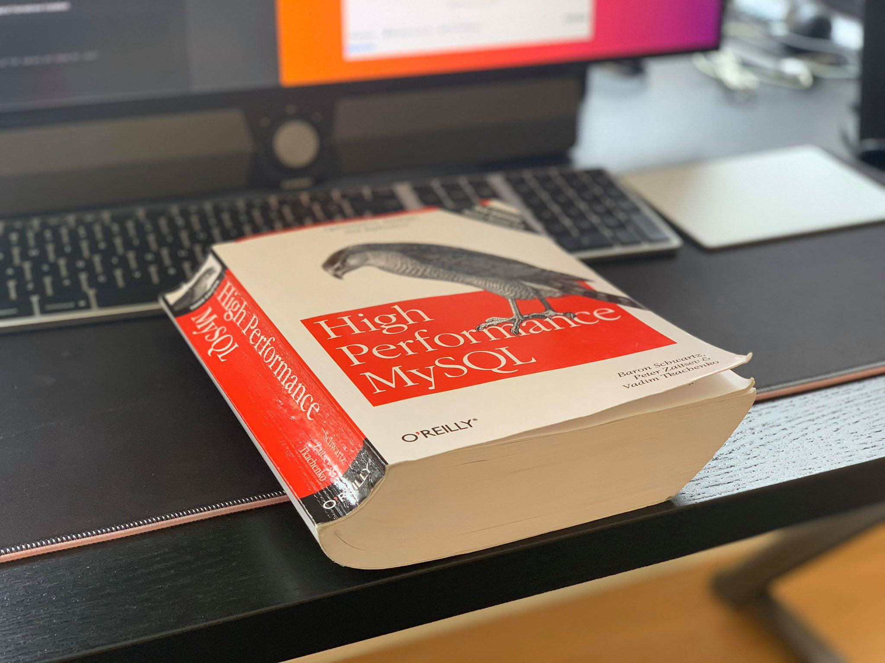

High Performance MySQL Sandbox
==============================



Recently I finished reading High Performance MySQL by Baron Schwartz, Peter
Zaitsev and Vadim Tkachenko. The book covers replication, partitioning,
benchmarking, query analysis, etc. This repo is a collection of little
"sandbox" environments I created to just kick-the-tires and try stuff out.

The first thing I'm going to try is setting up MySQL replication using docker
and docker-compose. I'll use a container with tmux and tmuxinator to make a
visualization.

Files
-----
- Dockerfile-tmuxinator
A dockerfile that builds an image which has tmux, tmuxinator, vim and the
docker client binaries. The idea is to run a container which has the docker
socket of the host mounted to display a tmux session (defined and initiated
with tmuxinator) displaying a demonstration of various setups (such as a mysql
master and slave setup in docker-compose)

```
# build visualization container image
$ docker build -f ./Dockerfile-tmuxinator -t tmuxinator .

# start the containers
$ cd replication
$ docker-compose build
$ docker-compose up

# start visualization container
$ docker run \
    --rm \
    -it \
    -v /var/run/docker.sock:/var/run/docker.sock \
    --name tmuxinator \
    tmuxinator:latest \
    tmuxinator start -p /root/tmuxinator-replication.yml
```

NOTE:
- get tmux layout
`docker exec tmuxinator tmux list-windows | sed -n 's/.*layout \(.*\)] @.*/\1/p'`
